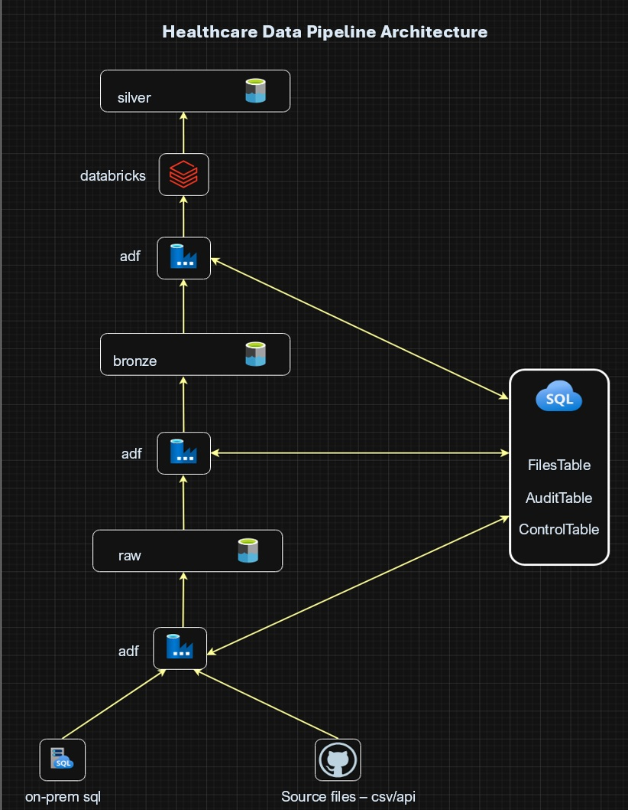
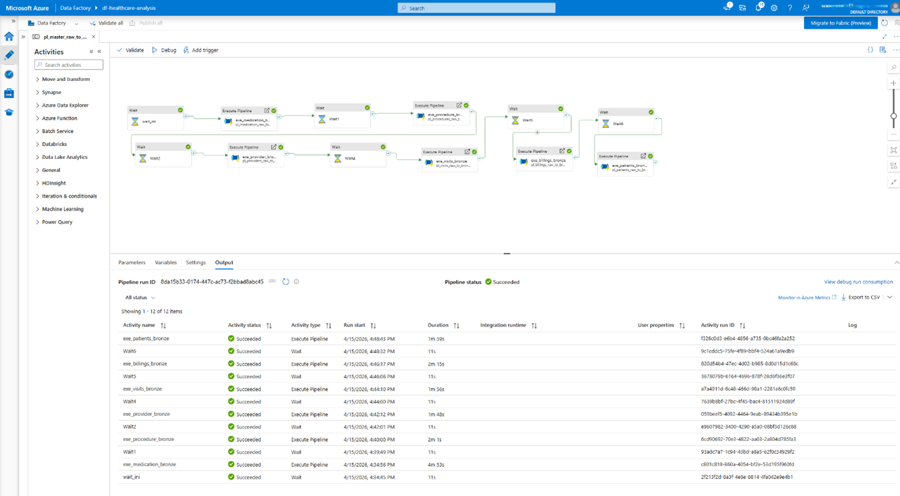
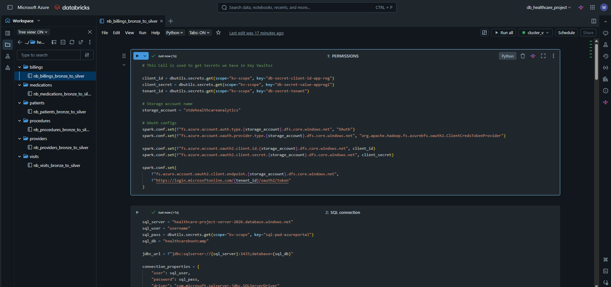

# healthcare-data-pipeline

Built a production-grade healthcare data pipeline using Azure Data Factory and Databricks to process multiple datasets (patients, providers, visits, billings) with incremental ingestion, audit tracking, and Bronze-to-Silver transformations.

## Architecture

- Azure Data Factory (pipeline orchestration)
- Azure Data Lake Storage Gen2 (Bronze & Silver layers)
- Azure Databricks (PySpark transformations)
- Delta Lake (ACID-compliant storage)
- Azure SQL Database (control tables & audit logging)
- Azure Key Vault (secure credential management)

## Data Flow
Source > Raw > Bronze > Silver

- Ingested source files into Raw/Bronze using ADF  
- Applied incremental processing using ingestion_time watermark  
- Performed deduplication using window functions in Databricks  
- Transformed and cleaned data written to Silver layer  
- Pipeline execution and file-level tracking maintained via SQL control tables  

## Key Features
- Incremental ingestion (watermark-based)
- Idempotent and rerunnable pipeline design
- Metadata-driven execution using control tables
- Audit logging for success, failure, and no-new-data scenarios
- Parameterized pipelines for multiple datasets
- Secure secret management via Azure Key Vault
- Master pipeline for orchestration

## ADF Pipeline

### Bronze to Silver Orchestration
This ADF pipeline orchestrates Bronze to Silver transformations across multiple healthcare datasets (patients, providers, visits, billings) using Execute Pipeline activities and parameterized runs.

Includes incremental processing using ingestion_time watermark and audit tracking via control tables.

## Control Tables

Provides end-to-end visibility into pipeline execution, enabling monitoring, failure tracking, and idempotent reprocessing.
- **Pipeline Control Table**: Stores dataset configuration (paths, load type, watermark column, active flag)
- **Files Table**: Tracks incoming files (file_name, batch_name, processed_flag) to prevent reprocessing and support incremental loads
- **Audit Log Table**: Tracks pipeline runs (table_name, batch_name, status, layer, timestamps)

## Databricks Transformation

PySpark-based transformations perform data cleaning, schema enforcement, and deduplication using window functions before writing optimized Delta tables to the Silver layer.
